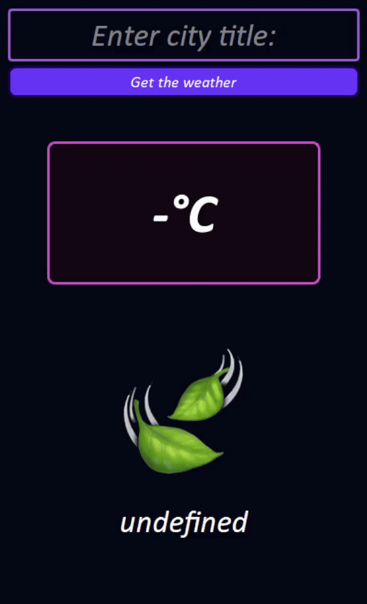
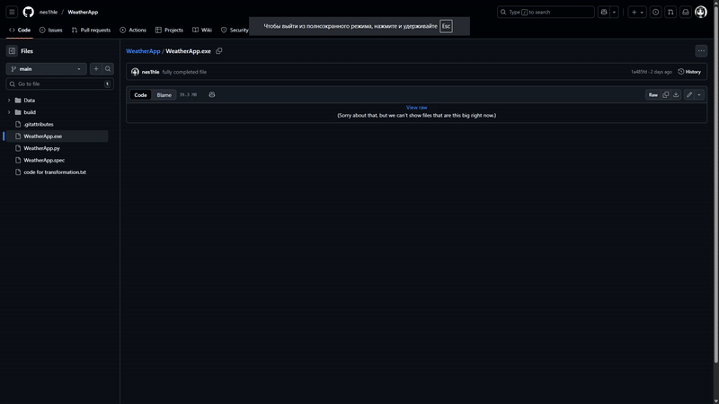

## **About application:**

#### This is default WeatherApp what use API and writed on Python with PyQt5 and requests libraries.

## **How it looks:**

## **How download it:**

#### [Click here](https://github.com/nes1hle/WeatherApp/blob/main/WeatherApp.exe)

